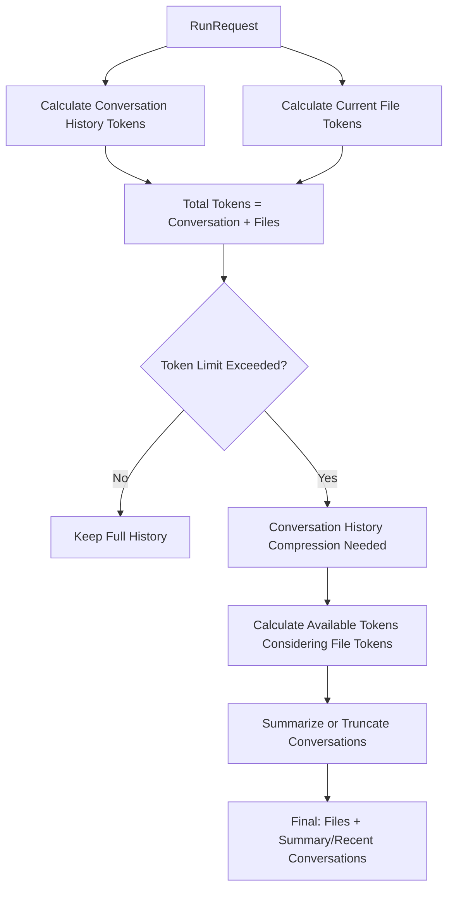

# Token Architecture Design

AgentRuntime's token management system uses an architecture that separates **conversation history** and **current request files** for processing.

## Architecture Overview

```
RunRequest {
    History: []Conversation     // Past conversations (text only)
    Files: []File              // Current request attachments
    ThreadInstruction: string
    Participants: []Participant
    UserInfo: *UserInfo
}

Conversation {
    User: string               // Username
    Text: string              // Conversation content (text only)
    Actions: []Action         // Executed actions
    // Note: Files are not included here!
}
```

## Token Calculation Methods

### 1. Conversation History Tokens (Past)

- **Target**: `RunRequest.History` (past conversations)
- **Includes**: Text + action results
- **Calculation**: Accurate text token count using tiktoken
- **Characteristics**: No file information (pure text conversations)

```go
conversationTokens := summarizer.CountConversationTokens(req.History)
```

### 2. Current Request File Tokens

- **Target**: `RunRequest.Files` (current request attachments)
- **Includes**: Images, PDFs, text, audio, etc.
- **Calculation**: Specialized algorithms per file type
- **Characteristics**: Context applied only to current request

```go
fileTokens := summarizer.CountRequestFilesTokens(req.Files)
```

### 3. Total Token Calculation

```go
totalTokens = conversationTokens + fileTokens
```

## Why This Architecture?

### ✅ Advantages of Current Design

1. **Clear Separation**: Past conversations and current files are logically separated
2. **Efficient Management**: Past conversations are lightweight without file information
3. **Accurate Calculation**: Optimized token calculation methods for each component
4. **Flexibility**: Files apply only to current requests, keeping history simple

### ❌ Problems with Alternative Design

```go
// What if Conversation had Files?
Conversation {
    User: string
    Text: string
    Actions: []Action
    Files: []File  // ❌ This would be problematic!
}
```

**Issues:**

1. **Bloated History**: Memory/storage burden from storing file info in every past conversation
2. **Increased Complexity**: Files would need to be considered during summarization
3. **Consistency Issues**: Different handling between past files and current files
4. **Unnecessary Duplication**: Same files could be duplicated across multiple conversations

## Token Limit Processing Flow



## Implementation Examples

### Token Calculation

```go
// Conversation history only (past)
conversationTokens := cs.CountConversationTokens(conversations)

// Current request files only
requestFilesTokens := cs.CountRequestFilesTokens(requestFiles)

// Total
totalTokens := conversationTokens + requestFilesTokens
```

### Token Limit Handling

```go
if totalTokens > cs.config.MaxTokens {
    // Available tokens excluding file tokens
    availableTokens := cs.config.MaxTokens - requestFilesTokens

    // Compress conversation history only
    conversations = cs.truncateToTokenLimit(conversations, availableTokens)
}
```

### Prompt Construction

```go
finalPrompt := systemPrompt +
               conversationSummary +  // Summarized past conversations
               recentConversations +  // Recent conversations
               fileContexts          // Current request files
```

## Benefits Summary

1. **Scalability**: Easy to add new file types
2. **Performance**: Fast processing with lightweight conversation history
3. **Accuracy**: Context-appropriate token calculation
4. **Maintainability**: Clear separation of responsibilities for better code understanding
5. **Memory Efficiency**: Prevents unnecessary duplication of file information

Through this architecture, AgentRuntime can efficiently manage tokens even with long conversations and large files.
