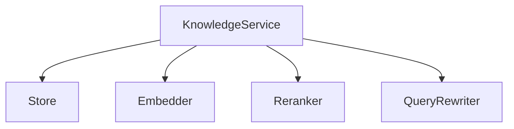
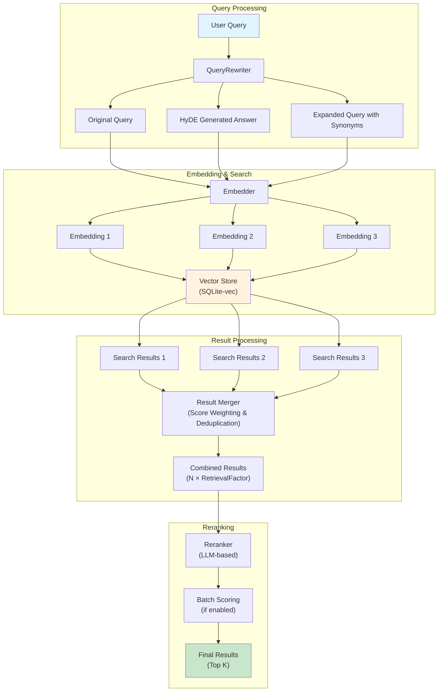

# Knowledge Package

The knowledge package provides a flexible and extensible knowledge management system with built-in RAG (Retrieval-Augmented Generation) capabilities.

## Recent Improvements

### Enhanced Retrieval Pipeline

- **Query Rewriting**: Added multiple strategies (HyDE, Query Expansion, Multi-Strategy) for better search accuracy
- **Advanced Reranking**: Implemented LLM-based reranking with batch processing support for improved relevance scoring
- **Multi-Query Search**: Support for searching with multiple rewritten queries simultaneously
- **Score Weighting & Deduplication**: Intelligent merging of results from different queries with score adjustment
- **SQLite Vector Store**: Production-ready vector storage using sqlite-vec for efficient similarity search

## Features

- **Flexible Storage**: Pluggable Store interface allows custom implementations
- **Vector Search**: Built-in embedding and similarity search with SQLite-vec
- **Smart Query Processing**: Query rewriting with HyDE, expansion, and multi-strategy approaches
- **LLM-based Reranking**: Optional reranking for improved relevance with batch processing
- **Knowledge Isolation**: Each knowledge has its own namespace with unique ID
- **Batch Processing**: Efficient batch operations for embeddings and reranking
- **Retrieval Factor**: Configurable over-retrieval for better reranking candidates

## Architecture



## Enhanced Retrieval Architecture



### Retrieval Flow Explained

1. **Query Rewriting Phase**

   - User query is processed by QueryRewriter
   - Multiple query variants are generated based on the configured strategy
   - Each variant targets different aspects of potential matches

2. **Parallel Embedding & Search**

   - All query variants are embedded simultaneously
   - Vector similarity search performed for each embedding
   - Results include similarity scores

3. **Intelligent Result Merging**

   - Results from different queries are merged
   - Duplicates are identified and highest scores retained
   - Score weighting applied (original query weighted higher)

4. **Reranking Phase**
   - Over-retrieval: Fetch N × RetrievalFactor candidates
   - LLM evaluates relevance of each candidate to original query
   - Batch processing available for efficiency
   - Final top K results returned

## Store Interface

The Store interface defines the contract for knowledge storage:

```go
type Store interface {
    Store(ctx context.Context, knowledge *Knowledge) error
    Search(ctx context.Context, queryEmbedding []float32, limit int) ([]KnowledgeSearchResult, error)
    GetKnowledgeById(ctx context.Context, knowledgeId string) (*Knowledge, error)
    DeleteKnowledgeById(ctx context.Context, knowledgeId string) error
    Close() error
}
```

### Built-in Implementation

- **SqliteStore**: Production-ready SQLite-based storage with vector search capabilities
  - Uses sqlite-vec extension for efficient vector similarity search
  - Supports up to 1536-dimensional embeddings (OpenAI text-embedding-3-small)
  - Automatic database schema management
  - Thread-safe with connection pooling

### Custom Implementation

To create a custom Store:

```go
type MyCustomStore struct {
    // your fields
}

func (s *MyCustomStore) Store(ctx context.Context, agentName string, items []KnowledgeItem) error {
    // implementation
}

// ... implement other methods

// Use with KnowledgeService
store := &MyCustomStore{}
service := knowledge.NewServiceWithStore(ctx, config, logger, genkit, store)
```

## Query Rewriting

Query rewriting improves search accuracy by transforming user queries into more search-friendly formats.

### Available Strategies

#### 1. HyDE (Hypothetical Document Embeddings)

Generates a hypothetical answer to the query and searches using both the original query and the generated answer.

**Best for**: Questions where the answer format differs significantly from the question.

**Example**:

- Query: "How does Redis handle persistence?"
- Generated: "Redis handles persistence through two main mechanisms: RDB snapshots and AOF..."
- Result: Better matches with technical documentation

#### 2. Query Expansion

Expands queries with synonyms and related terms to catch documents using different terminology.

**Best for**: Technical topics with multiple terms for the same concept.

**Example**:

- Query: "Python debugging"
- Expanded: "Python debugging pdb breakpoint stack trace debugger"
- Result: Finds documents mentioning any debugging-related terms

#### 3. Multi-Strategy

Combines both HyDE and Query Expansion for comprehensive coverage.

**Best for**: Critical queries where recall is more important than cost.

#### 4. None

Disables query rewriting, using only the original query.

**Best for**: When queries are already well-formed or to minimize costs.

### Configuration

```yaml
knowledge:
  # Enable query rewriting
  queryRewriteEnabled: true

  # Choose strategy: "hyde", "expansion", "multi", "none"
  queryRewriteStrategy: hyde

  # LLM model for rewriting (defaults to rerankModel if not set)
  queryRewriteModel: gpt-4o-mini
```

### Custom Query Rewriter

Implement the QueryRewriter interface:

```go
type MyRewriter struct{}

func (r *MyRewriter) Rewrite(ctx context.Context, query string) ([]string, error) {
    // Your rewriting logic
    return []string{query, rewrittenQuery}, nil
}
```

## Reranking

Reranking uses an LLM to score and reorder search results based on relevance to the query.

### Configuration

```yaml
knowledge:
  # Enable reranking
  rerankEnabled: true

  # LLM model for reranking
  rerankModel: gpt-4o-mini

  # Number of final results
  rerankTopK: 5

  # Retrieve N times more candidates for reranking
  retrievalFactor: 3

  # Use batch processing (more efficient)
  useBatchRerank: true
```

## Usage Example

```go
// Create service with default SQLite store
service, err := knowledge.NewService(ctx, config, logger, genkit)

// Or with custom store
customStore := NewMyCustomStore()
service, err := knowledge.NewServiceWithStore(ctx, config, logger, genkit, customStore)

// Index knowledge from maps
knowledgeData := []map[string]any{
    {"content": "Redis persistence uses RDB snapshots and AOF logs"},
    {"content": "Python debugging with pdb and breakpoints"},
    {"title": "Redis Configuration", "description": "How to configure Redis persistence"},
}
knowledge, err := service.IndexKnowledgeFromMap(ctx, "unique-knowledge-id", knowledgeData)

// Retrieve relevant knowledge
results, err := service.RetrieveRelevantKnowledge(ctx, "How to debug Python?", 5)
for _, result := range results {
    fmt.Printf("Score: %.2f, Content: %s\n", result.Score, result.Document.EmbeddingText)
}

// Get specific knowledge by ID
knowledge, err = service.GetKnowledge(ctx, "unique-knowledge-id")

// Delete knowledge
err = service.DeleteKnowledge(ctx, "unique-knowledge-id")
```

## Configuration Reference

```yaml
knowledge:
  # SQLite configuration
  sqliteEnabled: true
  sqlitePath: './knowledge.db'

  # Query rewriting configuration
  queryRewriteEnabled: true
  queryRewriteStrategy: 'hyde' # Options: "hyde", "expansion", "multi", "none"
  queryRewriteModel: 'gpt-4o-mini'

  # Reranking configuration
  rerankEnabled: true
  rerankModel: 'gpt-4o-mini'
  rerankTopK: 5
  retrievalFactor: 3 # Retrieve 3x more candidates for reranking
  useBatchRerank: true # More efficient for multiple results
```

## Performance Tips

1. **Optimize Retrieval Factor**:

   - Higher factor = better reranking candidates but more processing
   - Start with 3x and adjust based on quality/performance trade-offs

2. **Use Batch Reranking**:

   - Enable `useBatchRerank` for better efficiency
   - Single LLM call vs multiple calls
   - Significantly faster for large result sets

3. **Query Strategy Selection**:

   - HyDE: Best for Q&A, adds ~1 LLM call
   - Expansion: Good for keyword variations, adds ~1 LLM call
   - Multi: Most comprehensive but adds ~2 LLM calls
   - None: Fastest, no additional LLM calls

4. **Embedding Caching**:
   - Consider caching embeddings for frequently accessed documents
   - Store embeddings with documents to avoid re-computation

## Best Practices

1. **Choose the Right Strategy**:

   - Use HyDE for question-answering scenarios
   - Use Expansion for technical documentation
   - Use Multi for critical applications
   - Use None for already well-formed queries

2. **Balance Cost vs Quality**:

   - Query rewriting adds 1-2 LLM calls per query
   - Reranking adds 1 LLM call (batch) or N calls (non-batch)
   - Monitor token usage and adjust strategies

3. **Test Different Configurations**:

   - Benchmark different strategies with your data
   - Measure precision, recall, and latency
   - Consider A/B testing in production

4. **Custom Stores**:

   - Implement atomic operations
   - Handle concurrent access properly
   - Consider connection pooling
   - Add appropriate indexes for metadata queries

5. **Knowledge Organization**:
   - Use meaningful knowledge IDs for easy management
   - Include rich metadata for filtering
   - Keep document sizes reasonable (avoid very large chunks)
   - Consider hierarchical organization for large datasets
